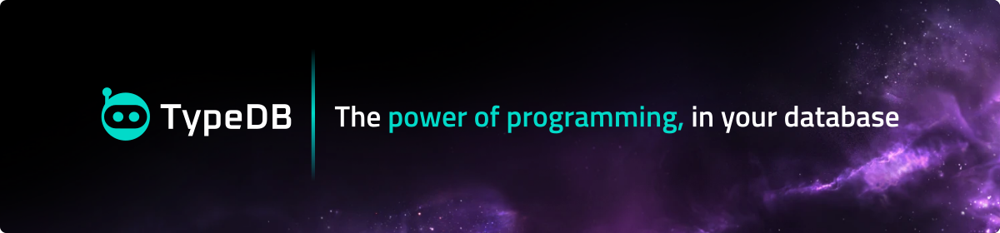

<!-- PROJECT LOGO -->

  <h3 align="center">Build data applications faster, safer, and more elegantly.</h3>

**TypeDB** is a next-gen database with a modern programming paradigm that lets you build data applications faster, safer, and more elegantly. Its intuitive and powerful data model unifies the strengths of relational, document and graph databases without their shortcomings. **TypeQL**, its groundbreaking query language, is declarative, functional, and strongly-typed, drastically simplifying data handling and logic. So now, even the most nested and interconnected datasets can be managed with ease. With TypeDB, we’ve reinvented the database for the modern programming era.

  

    <a href="https://typedb.com/docs"><strong>Documentation</strong></a>
    ·
    <a href="https://forum.typedb.com/"><strong>Forum</strong></a>
    ·
    <a href="https://typedb.com/discord"><strong>Discord Server</strong></a>
    ·
    <a href="https://github.com/typedb-osi"><strong>Community Projects</strong></a>
  

    <h3 align="center"><a href="www.typedb.com">Visit typedb.com »</a></h3>

### Getting started with TypeDB

- [Download and install](https://typedb.com/docs/home/install/overview) TypeDB.
- Explore TypeDB in our [Quickstart](https://typedb.com/docs/home/quickstart) and [Crash Course](https://typedb.com/docs/home/crash-course).
- Master TypeDB with [TypeDB Academy](https://typedb.com/docs/academy).
- Discover more of TypeDB’s unique [Features](https://typedb.com/features).
- Find in-depth articles and lectures in our [Learning Center](https://typedb.com/learn).
